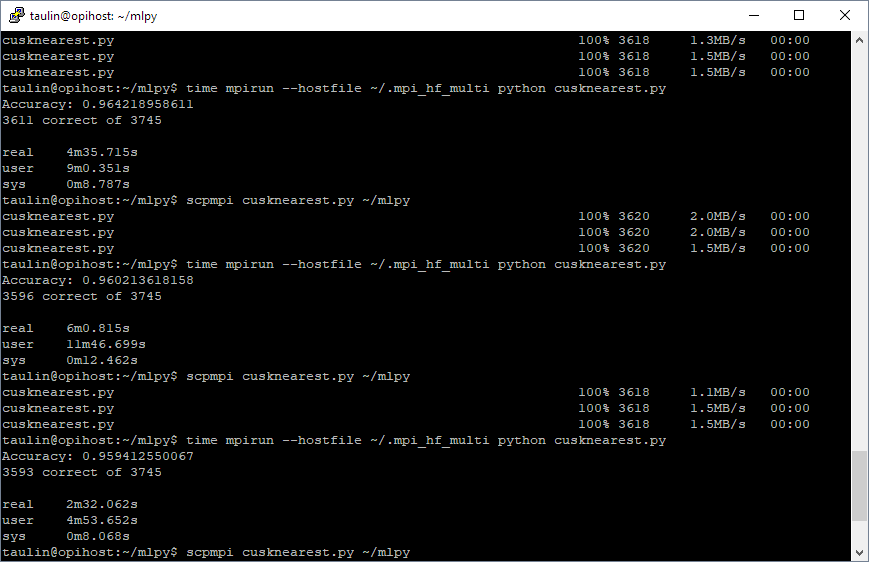

# knearest-mpi4py
Knearest Neighbors script in python using mpi4py to thread out to cluster

made following the machine learning for python guides by sentdex
https://www.youtube.com/watch?v=1i0zu9jHN6U&index=14&list=PLQVvvaa0QuDfKTOs3Keq_kaG2P55YRn5v
but implementing mpi to thread work out to a cluster of computers, or SBCs like raspberry pi

efficiency of this script has been improved by adding the ability to define a radius around the
test points that the script will check the euclidian distance to. the values used in the script
are tailored to the example dataset and will depend greatly on what kind of data you are using

there are three major parts to the radius calculation; fields, radius and strength

"fields" is a list of fields or columns in the dataset to use for the radius calculation. this
should be as few as possible and contain the columns that most correlate to the result

"radius" is the percentage (decimal 0.0 to 1.0) of deviation to the values of the test data that
we want to be able to calculate the distance to, there is no point calculating distance to points
on the extreme opposite end of the spectrum. this value will depend on how much variance is in
your dataset values

"strength" is percentage of tested fields are within the radius for the data to be used in the 
distance calculation

4m35s - no fields tested against

6m0s - testing against 12 of 13 fields (not recommended, obviously)

2m32s - testing against 1 of 13 fields (field that most correlates with group)
